# Лабораторная работа №1

 ## Часть 1: Логирование

 ### Настройка среды с Docker Compose

1. Создание файла `docker-compose.yml`
    <details>
    <summary>Содержимое</summary>

    ```yml
    services:
    nextcloud:
        image: nextcloud:29.0.6
        container_name: nextcloud
        ports:
        - "8080:80"
        volumes:
        - nc-data:/var/www/html/data

    loki:
        image: grafana/loki:2.9.0
        container_name: loki
        ports:
        - "3100:3100"
        command: -config.file=/etc/loki/local-config.yaml

    promtail:
        image: grafana/promtail:2.9.0
        container_name: promtail
        volumes:
        - nc-data:/opt/nc_data
        - ./promtail_config.yml:/etc/promtail/config.yml
        command: -config.file=/etc/promtail/config.yml

    grafana:
        image: grafana/grafana:11.2.0
        container_name: grafana
        environment:
        - GF_PATHS_PROVISIONING=/etc/grafana/provisioning
        - GF_AUTH_ANONYMOUS_ENABLED=true
        - GF_AUTH_ANONYMOUS_ORG_ROLE=Admin
        command: /run.sh
        ports:
        - "3000:3000"

    postgres-zabbix:
        image: postgres:15
        container_name: postgres-zabbix
        environment:
        POSTGRES_USER: zabbix
        POSTGRES_PASSWORD: zabbix
        POSTGRES_DB: zabbix
        volumes:
        - zabbix-db:/var/lib/postgresql/data
        healthcheck:
        test: ["CMD", "pg_isready", "-U", "zabbix"]
        interval: 10s
        retries: 5
        start_period: 5s

    zabbix-server:
        image: zabbix/zabbix-server-pgsql:ubuntu-6.4-latest
        container_name: zabbix-back
        ports:
        - "10051:10051"
        depends_on:
        - postgres-zabbix
        environment:
        POSTGRES_USER: zabbix
        POSTGRES_PASSWORD: zabbix
        POSTGRES_DB: zabbix
        DB_SERVER_HOST: postgres-zabbix

    zabbix-web-nginx-pgsql:
        image: zabbix/zabbix-web-nginx-pgsql:ubuntu-6.4-latest
        container_name: zabbix-front
        ports:
        - "8082:8080"
        depends_on:
        - postgres-zabbix
        environment:
        POSTGRES_USER: zabbix
        POSTGRES_PASSWORD: zabbix
        POSTGRES_DB: zabbix
        DB_SERVER_HOST: postgres-zabbix
        ZBX_SERVER_HOST: zabbix-back

    volumes:
    nc-data:
    zabbix-db:
    ```

    </details><br>

2. Создание `promtail_config.yml`
    <details>
    <summary>Содержимое</summary>

    ```yml
    server:
    http_listen_port: 9080
    grpc_listen_port: 0
    positions:
    filename: /tmp/positions.yaml
    clients:
    - url: http://loki:3100/loki/api/v1/push # адрес Loki, куда будут слаться логи
    scrape_configs:
    - job_name: system # любое имя
    static_configs:
    - targets:
    - localhost # т.к. монтируем папку с логами прямо в контейнер Loki, он собирает логи со своей локальной файловой системы
    labels:
    job: nextcloud_logs # любое имя, по этому полю будет осуществляться индексирование
    __path__: /opt/nc_data/*.log # необязательно указывать полный путь, главное сказать где искать log файлы
    ```

    </details><br>

1. Запуск `compose` файла
   ```bash
   $ sudo docker compose up -d

   [+] Running 8/8
    ✔ Network lab1_default       Created                                      0.1s 
    ✔ Container postgres-zabbix  Started                                      1.8s 
    ✔ Container nextcloud        Started                                      1.8s 
    ✔ Container loki             Started                                      1.5s 
    ✔ Container promtail         Started                                      1.9s 
    ✔ Container grafana          Started                                      1.5s 
    ✔ Container zabbix-front     Started                                      4.1s 
    ✔ Container zabbix-back      Started                                      3.9s 

   $ sudo docker ps

   CONTAINER ID   IMAGE                                             COMMAND                  CREATED         STATUS                   PORTS                                                   NAMES
   6b91c19f9bb1   zabbix/zabbix-server-pgsql:ubuntu-6.4-latest      "/usr/bin/tini -- /u…"   2 minutes ago   Up 2 minutes             0.0.0.0:10051->10051/tcp, :::10051->10051/tcp           zabbix-back
   3b3206a9bb7b   zabbix/zabbix-web-nginx-pgsql:ubuntu-6.4-latest   "docker-entrypoint.sh"   2 minutes ago   Up 2 minutes             8443/tcp, 0.0.0.0:8082->8080/tcp, [::]:8082->8080/tcp   zabbix-front
   ecf4f696fad6   nextcloud:29.0.6                                  "/entrypoint.sh apac…"   2 minutes ago   Up 2 minutes             0.0.0.0:8080->80/tcp, [::]:8080->80/tcp                 nextcloud
   27fcd45c7fa2   postgres:15                                       "docker-entrypoint.s…"   2 minutes ago   Up 2 minutes (healthy)   5432/tcp                                                postgres-zabbix
   9b8d24e03b8c   grafana/loki:2.9.0                                "/usr/bin/loki -conf…"   2 minutes ago   Up 2 minutes             0.0.0.0:3100->3100/tcp, :::3100->3100/tcp               loki
   f0b08ecb8928   grafana/grafana:11.2.0                            "/run.sh /run.sh"        2 minutes ago   Up 2 minutes             0.0.0.0:3000->3000/tcp, :::3000->3000/tcp               grafana

   $ ls -la

   total 16
   drwxrwxr-x 2 mgd2003d mgd2003d 4096 Oct  9 14:56 .
   drwxrwxr-x 4 mgd2003d mgd2003d 4096 Oct  9 15:47 ..
   -rw-rw-r-- 1 mgd2003d mgd2003d 1910 Oct  9 15:16 docker-compose.yml
   -rw-rw-r-- 1 mgd2003d mgd2003d  808 Oct  9 14:57 promtail_config.yml

   ```

   *`nc_data` и `zabbix_db` создаются Docker'ом как volumes и не отображаются в локальной файловой системе по умолчанию*

   ```bash
   $ sudo docker volume ls
   DRIVER    VOLUME NAME
   local     2ff3a7280c3a8a3b1d28217c1d90583f74f9004f716d9b145754d5e3fdcf8e90
   local     8317de901fa64b3c48cb3734e420f2f212fda99a6f28cad8ebebefa8fa6c9323
   local     45538a786fc0f0176df3f6606bf0039efcc31bf3f42b70fc2372628e3a7d2c7f
   local     5352620a4425d308aa0ef81d5f45a32efd91e29945accb8dd53ab62bb02ba915
   local     d93e9b16c8f61f34998501ba2026dbfd4a24fdd6ef1ee139f00fcfddb5433188
   local     e229a81597ea39a2adcd31f6b6906fe1084a35af7f2cfb54669786331a03cf04
   local     lab1_nc-data
   local     lab1_zabbix-db

   ```
4. Инициализация `Nextcloud`
    <details>
    <summary>Изображение</summary>

    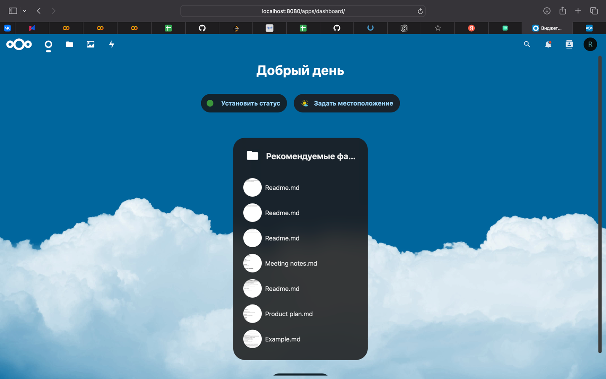
    </details>
    <details>
    <summary>logs</summary>

    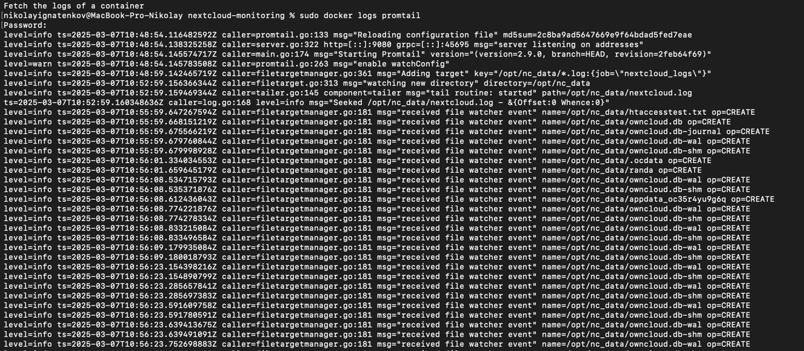
    </details>
      

    

 ## Часть 2: Мониторинг
 
1. Теперь настраиваем Zabbix. Подключаемся к веб-интерфейсу (http://localhost:8082 или свой выбранный порт из композ файла).

2. В разделе Data collection → Templates делаем Import кастомного шаблона (темплейта) для мониторинга nextcloud.
```yml
   zabbix_export:
  version: '6.4'
  template_groups:
    - uuid: a571c0d144b14fd4a87a9d9b2aa9fcd6
      name: Templates/Applications
  templates:
    - uuid: a615dc391a474a9fb24bee9f0ae57e9e
      template: 'Test ping template'
      name: 'Test ping template'
      groups:
        - name: Templates/Applications
      items:
        - uuid: a987740f59d54b57a9201f2bc2dae8dc
          name: 'Nextcloud: ping service'
          type: HTTP_AGENT
          key: nextcloud.ping
          value_type: TEXT
          trends: '0'
          preprocessing:
            - type: JSONPATH
              parameters:
                - $.body.maintenance
            - type: STR_REPLACE
              parameters:
                - 'false'
                - healthy
            - type: STR_REPLACE
              parameters:
                - 'true'
                - unhealthy
          url: 'http://{HOST.HOST}/status.php'
          output_format: JSON
          triggers:
            - uuid: a904f3e66ca042a3a455bcf1c2fc5c8e
              expression: 'last(/Test ping template/nextcloud.ping)="unhealthy"'
              recovery_mode: RECOVERY_EXPRESSION
              recovery_expression: 'last(/Test ping template/nextcloud.ping)="healthy"'
              name: 'Nextcloud is in maintenance mode'
              priority: DISASTER
```

   <details>
   <summary>Изображение</summary>

   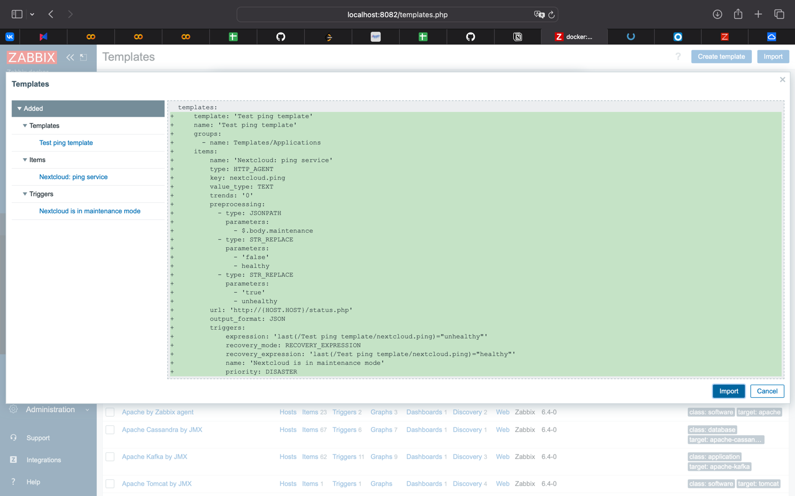
   </details><br>

3. Чтобы Zabbix и Nextcloud могли общаться по своим коротким именам внутри докеровской сети, в некстклауде необходимо “разрешить” это имя.
    <details>
    <summary>Изображение</summary>

    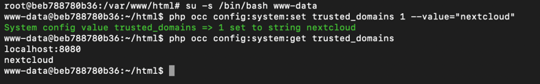
    </details><br>

4. Добавляем хоста.
    <details>
    <summary>Изображение</summary>

    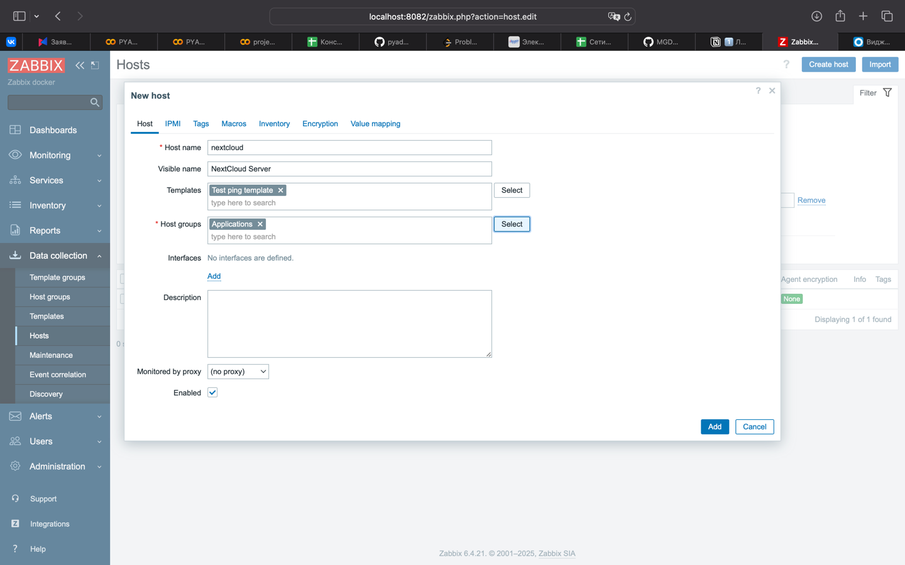
    </details><br>
    
5. Переходим к мониторингу.
    <details>
    <summary>Изображение</summary>

    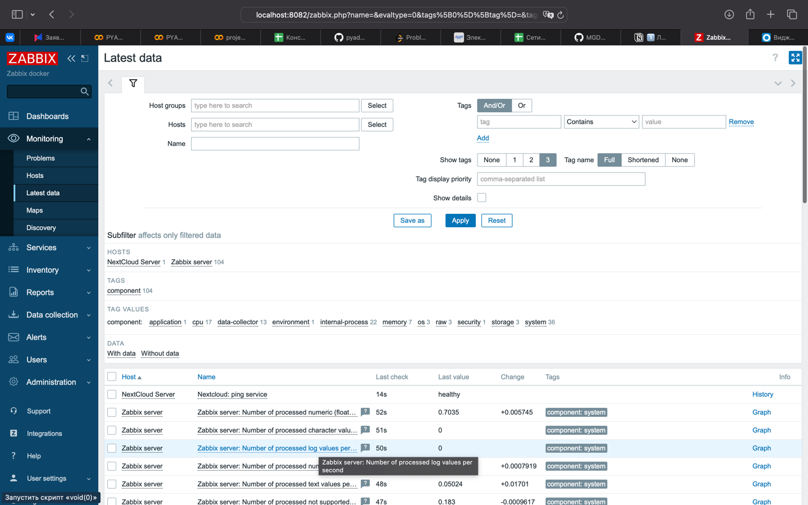
    </details><br>


 ## Часть 3: Визуализация

1. В терминале выполняем команду `docker exec -it grafana bash -c "grafana cli plugins install alexanderzobnin-zabbix-app"`, затем `docker restart grafana`.
    <details>
    <summary>Изображение</summary>

    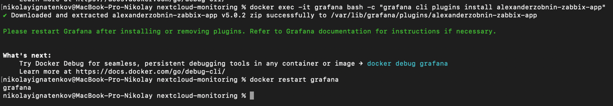
    </details><br>

2. Затем активируем Zabbix в Grafana.

3. Подключаем Loki к Grafana.
    <details>
    <summary>Изображение</summary>

    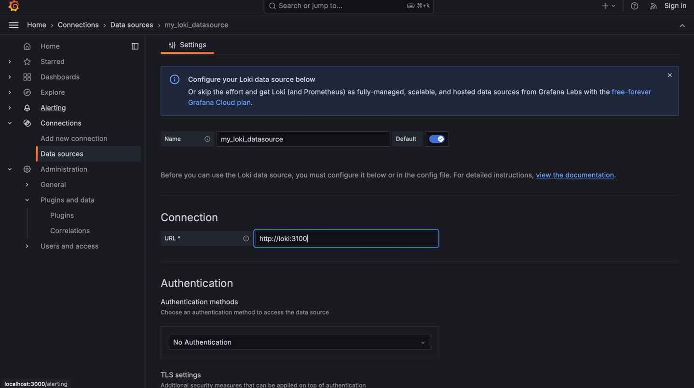
    </details><br>
    
4. Сохраняем подключение.
    <details>
    <summary>Изображение</summary>

    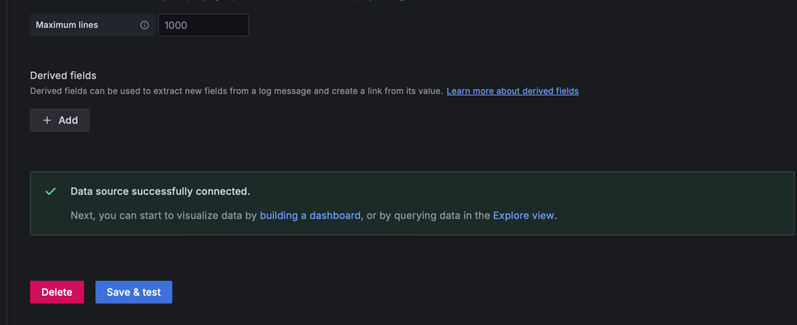
    </details><br>
    
5. Все так же делаем с Zabbix. В качестве URL указываем `http://zabbix-front:8080/api_jsonrpc.php`.
    <details>
    <summary>Изображение</summary>

    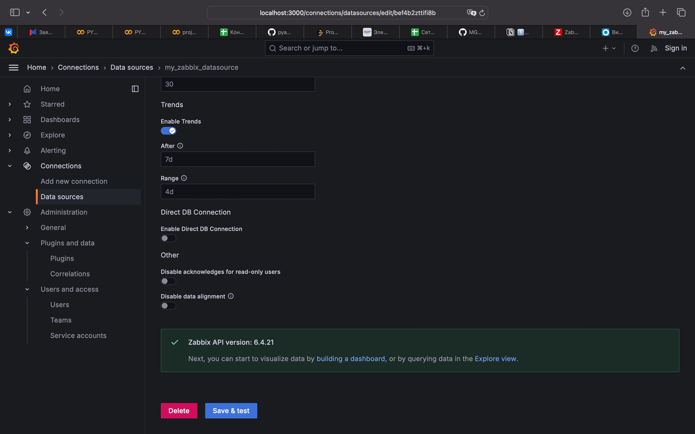
    </details><br>
    
6. Переходим в Explore и наблюдаем наши логи.
    <details>
    <summary>Изображение</summary>

    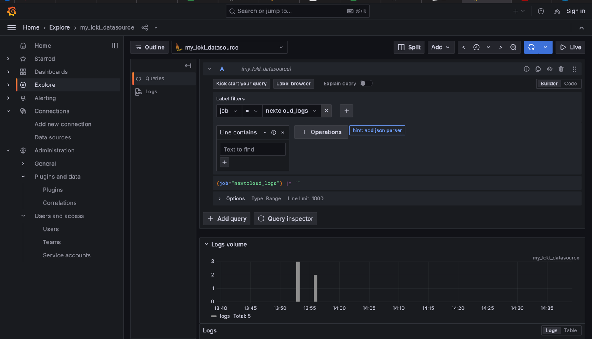
    </details>


7. То же самое с забиксом, при выставлении всех фильтров.
    <details>
    <summary>Изображение</summary>

    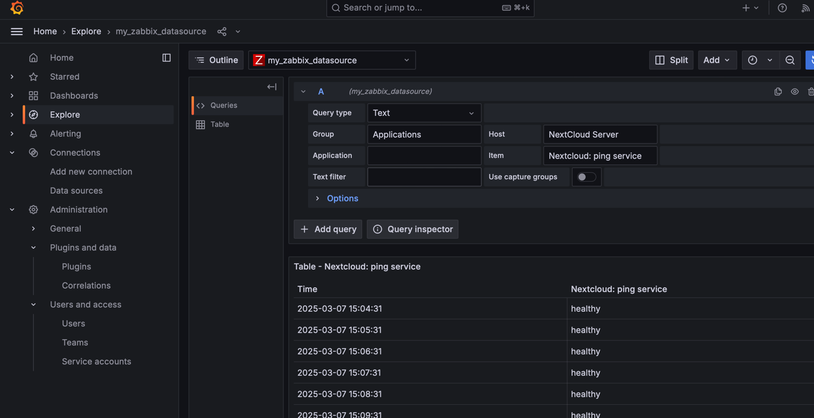
    </details><br>

 ## Задание

1. Дашборды:
    <details>
    <summary>Изображение</summary>

    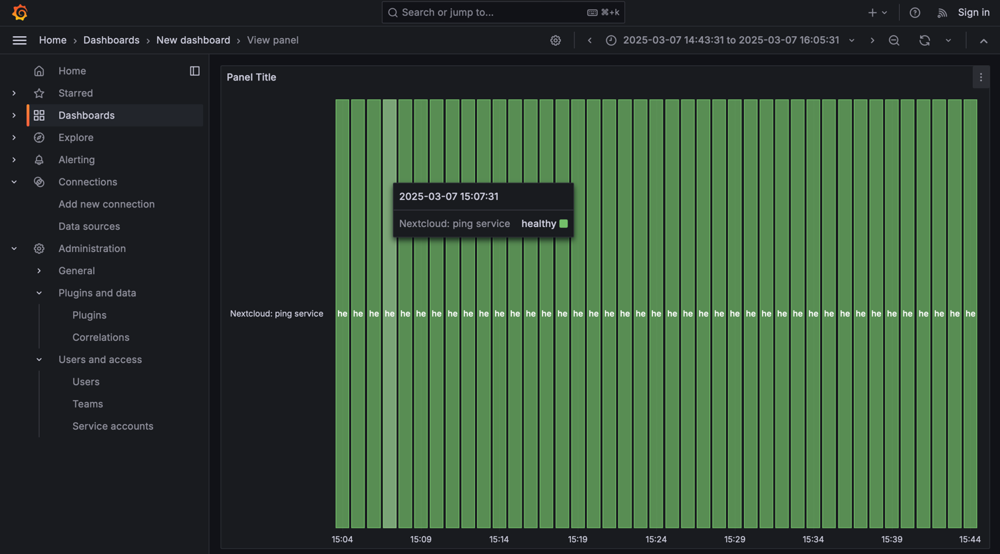
    </details><br>

2. Вопросы:
   
   *Чем SLO отличается от SLA?*
   
   SLA — это более формальное и юридически обязывающее соглашение, тогда как SLO — это целевые показатели, на которые     можно ориентироваться для оценки производительности сервиса. Оба эти инструмента помогают в управлении ожиданиями и    обеспечении качества обслуживания.

   *Чем отличается инкрементальный бэкап от дифференциального?*
   
   Инкрементальный - создаёт копии только тех данных, которые изменились с момента последнего бэкапа.
   Дифференциальный - создаёт копии всех изменённых данных с момента последнего полного бэкапа.
   
   *В чем разница между мониторингом и observability?*
   
   Мониторинг — это часть observability. Если мониторинг позволяет отслеживать состояние системы, то observability дает возможность понять, почему система ведет себя именно так.
